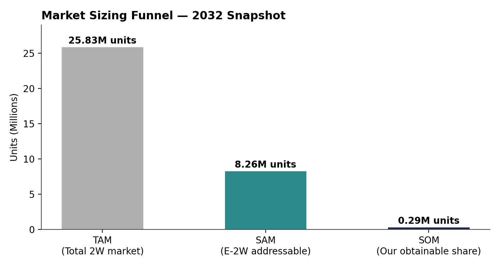

# India Market Entry Strategy: Two-Wheeler EVs

**An independent consulting-style case study: should a global EV company enter India's two-wheeler EV market, and how?**

Built from scratch using real public data (no Kaggle/pre-made datasets) — government registration data, industry reports, and policy documents — structured using the SCQA framework (Situation, Complication, Question, Answer).

## TL;DR

- **Situation:** India's e-2W penetration nearly doubled in 6 months (6.6% → 11.2%, Jan–Jul 2026); it's the largest and fastest-growing EV segment in the world's biggest two-wheeler market.
- **Complication:** Top 4 incumbents (TVS, Bajaj, Ather, Hero) hold ~77% combined share and rising; unlike passenger cars, there's no import-first regulatory pathway for two-wheelers, forcing an immediate local-manufacturing/JV commitment.
- **Question:** Should the entrant go in, and through what entry mode?
- **Answer:** **Conditional GO** — enter via joint venture, sequenced through the B2B/fleet segment before consumer retail. A 5-year financial model + sensitivity analysis shows outcomes are ~4x more sensitive to execution quality than to policy/subsidy risk.

  

## What's in this repo

| File | What it is |
|---|---|
| `India_EV_Market_Entry_Executive_Summary.pdf` | Full case write-up (SCQA structure) — situation, complication, market sizing, competitive landscape, regulatory analysis, consumer research, quant model, recommendation, risks, appendix with sources |
| `India_EV_Market_Entry_Deck.pptx` | 9-slide presentation version, ready to present |
| `market_entry_model.py` | Python model: bottom-up TAM→SAM→SOM market sizing, 5-year revenue forecast, two-lever sensitivity analysis. Run with `python3 market_entry_model.py` |
| `base_case.csv` / `sensitivity.csv` | Model outputs |
| `charts/` | chart_funnel.png, chart_competitive.png, chart_revenue.png, chart_sensitivity.png|

## Method

1. **Market sizing** — triangulated a bottom-up TAM from real 2025 Vahan (Ministry of Road Transport) registration data rather than relying on a single market-research estimate (published forecasts varied by 4x+ depending on methodology).
2. **Competitive analysis** — H1 2026 FADA/Vahan registration data across TVS, Bajaj, Ather, Hero (Vida), and Ola Electric.
3. **Regulatory research** — PM E-DRIVE subsidy scheme, PLI localization thresholds, and the SPMEPCI import-duty scheme (and its absence for two-wheelers).
4. **Quantitative model** — Python-based 5-year forecast with explicit, documented assumptions and a two-lever sensitivity analysis (policy risk vs. execution risk).

## Key finding

The sensitivity analysis is the most important output: a **policy/subsidy scenario** (does central subsidy support return?) moves Year-5 revenue by ~1.4x, while an **execution scenario** (does JV/distribution build-out succeed?) moves it by ~4x. This reframes the strategic priority — due diligence on the entry partner matters more than timing the policy cycle.

*All market data drawn from public sources (Vahan Dashboard, JMK Research, FADA, Ministry of Heavy Industries, BloombergNEF — full list in the PDF appendix). The entrant company is a hypothetical construct used to frame a realistic market-entry decision.*
